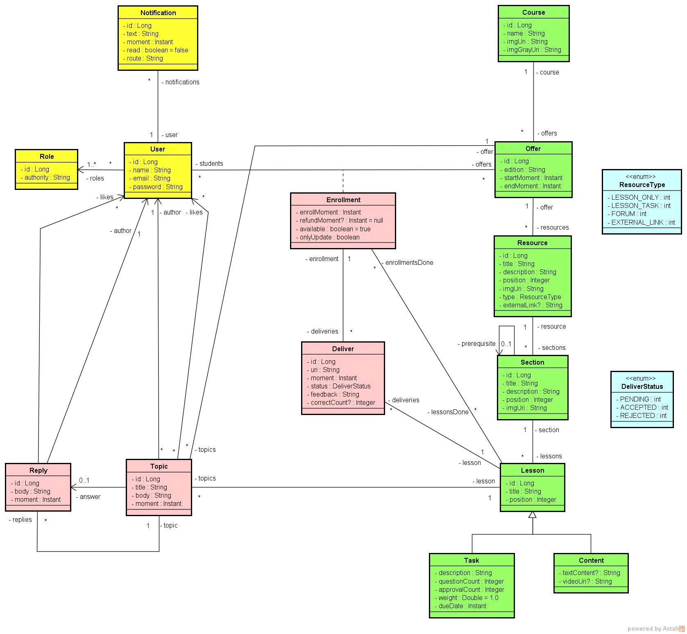

## Projeto Java Spring : Plataforma de Ensino.

Projeto  desenvolvido durante os estudos do curso Java Spring Collection - Prof. Dr Nelio Alves.
(Projeto em Desenvolvimento)
### 🚀 Tecnologias

Tecnologias utilizadas no desenvolvimento do Projeto:

### Modelo Conceitual:

